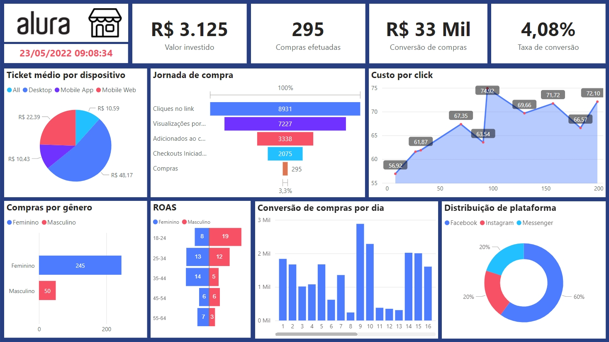
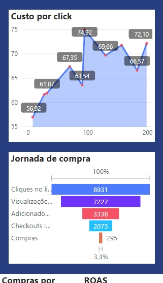

<h1 align="center">
    
</h1>

  :white_check_mark: <a href="https://app.powerbi.com/view?r=eyJrIjoiZTQwYzQ4ZjMtYzZhYS00MDc2LWE2M2UtNTM2N2UwMDE2NjlkIiwidCI6ImEzZTU3Zjc1LTU5YTktNDFkOS05ZGIwLTA0YmM0ODg2YWY3NyJ9&pageName=ReportSection" target="_blank">Veja o dashboard</a>
 &nbsp;&nbsp;&nbsp; | &nbsp;&nbsp;&nbsp;
  :white_check_mark: <a href="https://www.alura.com.br/challenges/bi/semana-02-marketing" target="_blank">Conheça o curso</a>

# :computer: Projeto
 
- Idealizador: Alura
- Projeto: Challenge BI
- Lado da força: Data Science
- Tipo: Business Intelligence
- Etapa: Alura Shop

# :rocket: Tecnologias

# :package: Recursos

### Excel

# :art: Layout PC

# :iphone: Layout Mobile

  
